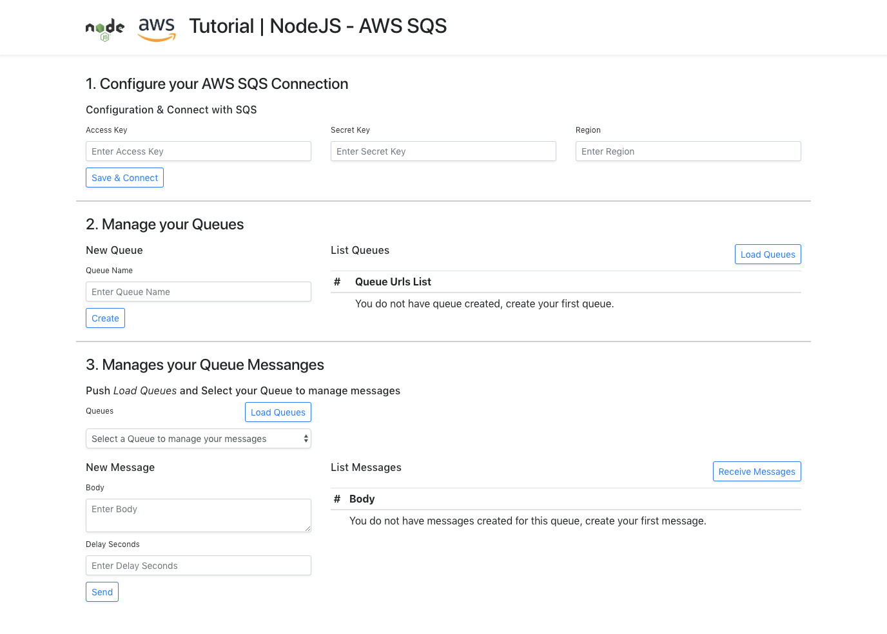

# Tutorial NodeJS and AWS SQS

Create Socket Server with NodeJS and AWS SQS.

## Getting Started

These instructions will get you a copy of the project up and running on your local machine for development and testing purposes.

### Prerequisites

- Git.
- Last version of NPM.

### Installing

1. Clone this repository.

2. Enter the directory.

3. Install Javascript dependencies.

```
npm install
npm start
```



### Configuration data that you need

How to obtain the ACCESS_KEY and SECRET_KEY?
https://docs.aws.amazon.com/es_es/AWSSimpleQueueService/latest/SQSDeveloperGuide/sqs-setting-up.html

Where to get the region? 
https://docs.aws.amazon.com/es_es/AWSEC2/latest/UserGuide/using-regions-availability-zones.html

### Contact

Send email to: jose.perez@sngular.com